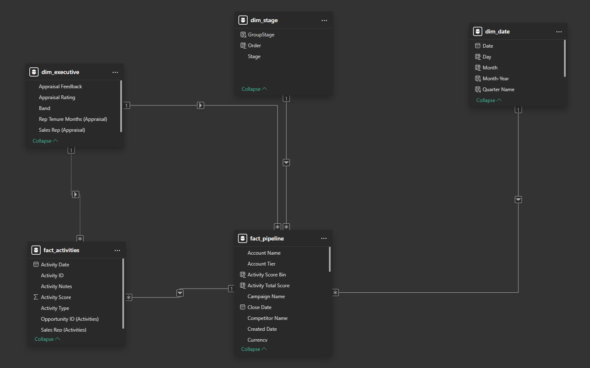
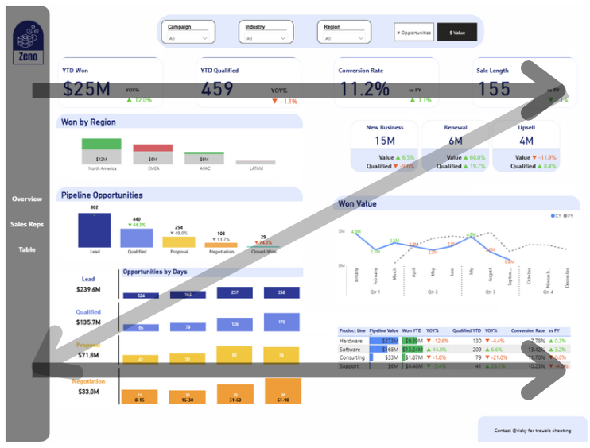
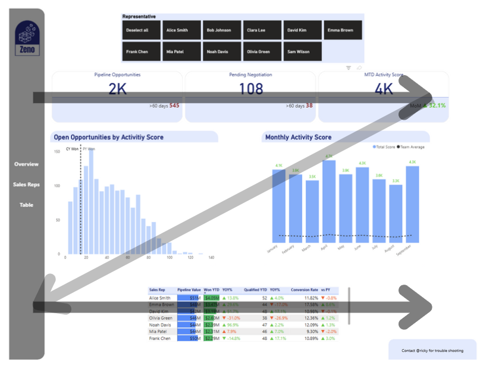
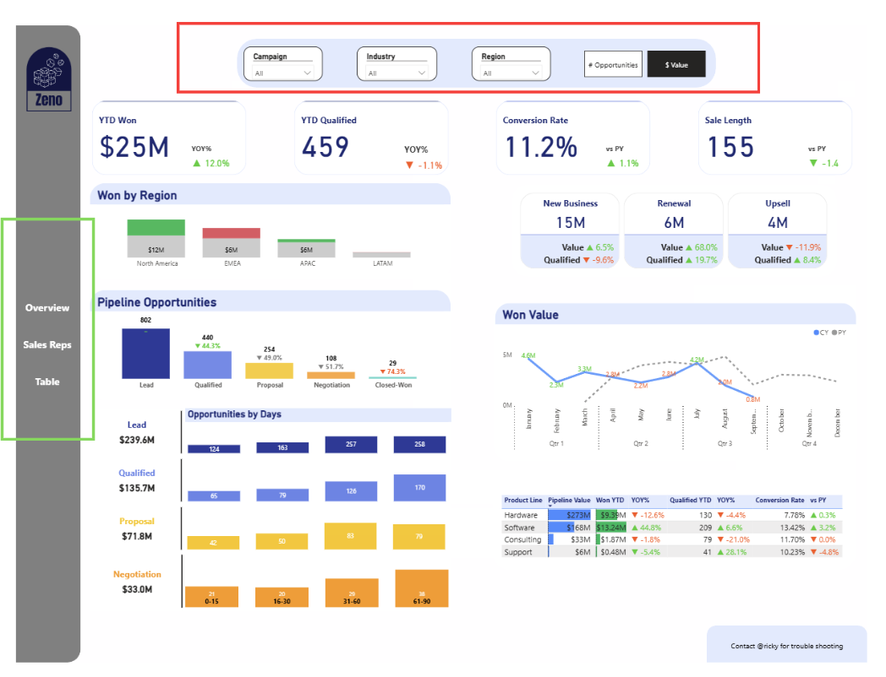

# Sales Pipeline Dashboard
[View Dashboard here](https://app.powerbi.com/view?r=eyJrIjoiYWIzZDkzYmYtNDc4Mi00OTI4LWJlNWQtNjAyYTUwOWQ4MjNlIiwidCI6IjRlMjA2ZGRmLTNkYzgtNGZlMC1hZGNkLWI5YTQzODY4YzU4YyJ9)
## Table of Contents
1. [Project Background](#project_background)
2. [Business Objectives](#business_objective)
3. [Executive Summary](#executive_summary)
4. [Data Model](#data_model)
5. [Design](#design)

---
## Project Background
Zeno is a technology consulting unicorn, launching from 2024, with a revenue of $35M. The startup offers 4 main IT services for customers from 4 different regions across wide range industries.

To better understanding its performance, productivity and customer demographic, the company set up analytic solution to give leadership a quick grasp of the status.

## Business Objectives

Performance: illustrate company YTD performance, comparing to  same period of previous year.
- What is the performance in these key metrics:
    - Value Won YTD
    - Qualified opportunities attracted YTD
    - Conversion Rate
    - Sales Length
- What is the growth in each region?
- What is the monthly:
    - Won Value
    - Qualified Opportunities
- What is the pipeline status at each stage?
- What is the performance of each product service?

Productivity: reveal the productivity and backlog of each employee.
- How many deals are open?
- How many deals are in negotiation stage?
- What is the MTD total activity score?
- How much effort was spent in the open opportunities?
- What is the monthly performance?

## Executive Summary
To address the objectives, I utilised Power BI to design an interactive 3-pages dashboard:

| Page | Audience | Purpose | 
|:-------:|:-------:|--------|
| Overview | Sales Manager | A quick grasp of YTD performance and growth |
| Sales Reps | Sales-Reps | Visibility of the team and individual productivity |
| Table | Sales-Reps | Table raw-data view for sales representative to extract |

The dashboard is updated up-to **27/09/2025**, highlighting that:
- Zeno has achieved **$25M** in sales (**12.0% YOY increase**), **11.2%** conversion rate (**1.1% higher vs PY**), and a sales length of **155 days** (**1.4 days shorter**), though attracting 1.1% YOY less deals.
- While *North America* and *APAC* achieve substantial **growth**, **$5M** and **$1M** respectively, *EMEA* suffered **$3m** **loss** in sales, surpassed by North America to be the leading region.
- *New Business* is proportionate for most of sales, with **6.5%** increase in value contradicting to the **9.6%** drop in number of prospects.
- The majority of the growth is due to Q1 where we did not generate any sales last year because of newly launching. Despite sharing similar pattern, Q2 and Q3 this year experienced lower sales, though having higher prospect number.
- The drop rate at each stage fluctuates in the range of 44% to 52%, with the exceptionally high drop of **74.3%** at Closing stage.
- Hardware and Software remain our spearhead product lines. While Software achieves **44.8%** YOY growth, due to **3.2%** increase in conversion rate, Hardware experiences a **12.6%** loss. However, Hardware still have $273M of prospect value in the pipeline, comparing to just $168M of Software.
- Each *sales representative* is managing a portfolio of **$40M** to **$55M**
- *Alice, Emma* and *David* are the leading representatives, as the trio have brought back a total of more than **$10M ** value in sales this year. Meanwhile, *Bob* is the *lowest* performer, having closed only **$1.14M** in sales and a conversion rate of only **7.22%**

## Data Model

    

The original generated sets consist of 3 table:
- `dim_executive`: dimensional table of executive
- `fact_activities`:fact table of activities done for every opportunity.
- `fact_pipeline`: fact table of opportunity status in the pipeline.

I created:
- `dim_date`: dimensional table of date data from 2024 to 2025 to leverage Power BI time intelligence built-in functions. The `date` is connected to `fact_pipeline`.`Created Date`
- `dim_stage`: to formulate stage calculations and order in the pipeline.

## Design

The dashboard design is following "Z-Pattern" layout, facilitating user's common eye focus

  
  

- A reader's eyes start in the top left corner and scan across the top of the page, where important metric score cards can be found.
- When the eyes reach the top right corner, they can shift their focus diagonally to the left bottom corner, scanning the secondary important charts.
- Then move across the bottom of the page for important but less impact ones.

The top bar can be used for slicing and dicing deeper into the data, offering user with filtering options and page navigation is on the left-hand side, out of the eye focusing zone.

    

In addition, the **Overview** page provides 2 perspectives: trend in value won and attracted prospects (passing qualified stage).

**Sales Reps** page provide a quick understanding of productivity and backlog of each/all employees from score cards and charts, while the bottom table offer a deep dive into individual contribution.

**Table** page mainly serves the representatives with detail of backlog for extraction and value prioritisation.

