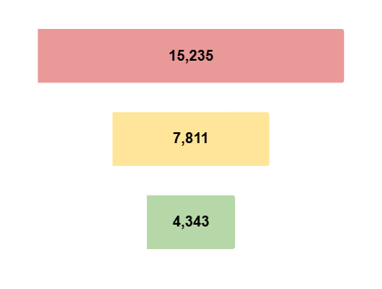
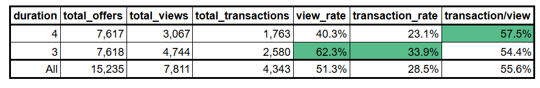
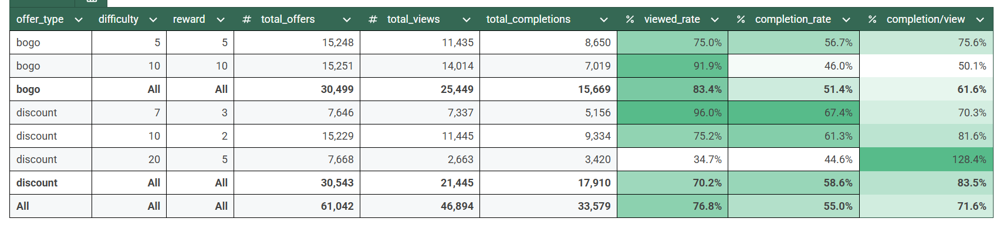
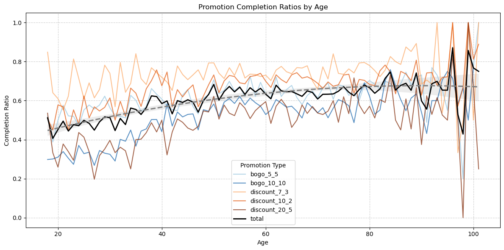
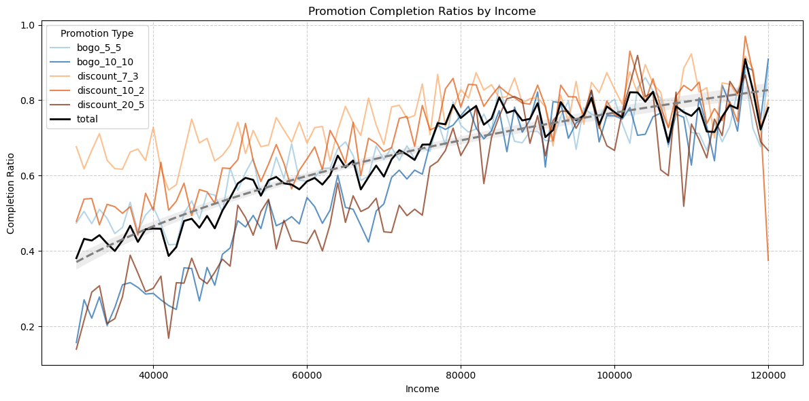
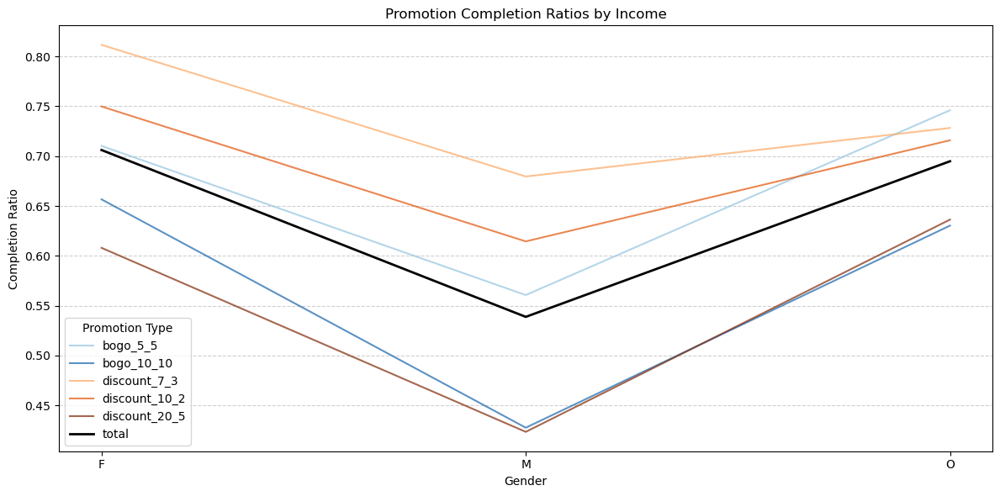
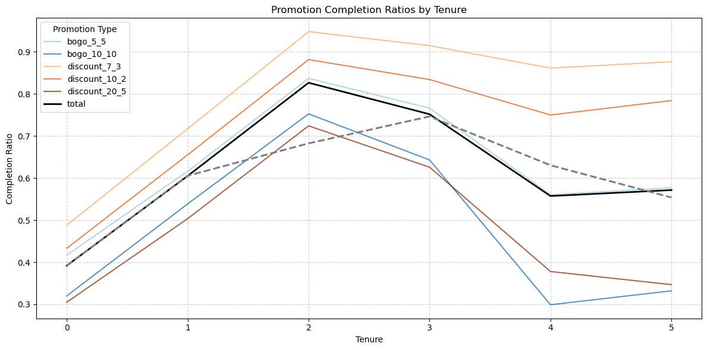
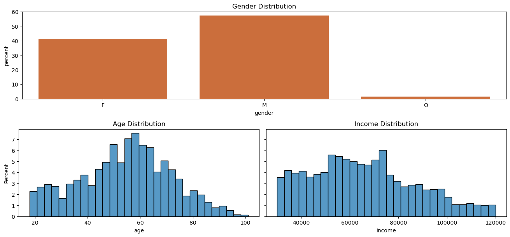

# Coffee Shop Promotion Campaign Analysis

## Table of Contents
1. [Project Background](#project-background)
2. [Business Objectives](#business-objectives)
3. [Executive Summary](#executive-summary)
4. [Insight Deep-dive](#insight-deep-dive)
    - [Informational offers](#informational-offers)
    - [Promotional offers: BOGO & Discount](#promotional-offers)
    - [Demographic Drivers](#demographic-drivers)
5. [Recommendations](#recommendations)

---

## Project Background
The Coar House is a mid-sized coffee shop chain generating an average monthly revenue of approximately $1.5 million. To strengthen customer engagement and increase sales, the company recently launched a membership rewards program. Under this program, registered members receive promotional offers on a recurring basis, typically every few days.

These offers vary in format and intent, ranging from:
- Informational offers: promotional messages highlighting new or seasonal menu items.
- Discount offers: price reductions when reaching a total purchase value
- Buy One, Get One (BOGO): bundled deals designed to drive volume and attract groups.

Given the competitive landscape of the coffee retail industry, The Coar House seeks to understand how these different types of offers influence customer behavior, such as purchase rates and redemption likelihood. This analysis will provide data-driven insights into the effectiveness of the membership program, helping the company refine its promotional strategy and improve customer loyalty.

## Business Objectives

We formulate the analysis to mainly answer the following areas:
- Informational:
    - How many offers were followed by transactions?
    - What is the completion rate?
- BOGO & Discount:
    - How many offers ware completed?
    - What is the completion rate at each stage of each type?
    - What is the highest completion rate?
- Customer demographics:
    - Are there any underlying patterns in the offer completion?
    - What are the difference at each group?

## Executive Summary

## Insight Deep-dive:
### Informational advertisement:
There are a total of **15k** advertisements sent throughout the period, with a view rate of **51.3%** and transaction rate of **28.5%**. In other words, roughly **4.3k** informational offers were followed up with a transaction.

    
    

Although, sharing similar number of offers, having slightly higher transaction/view statistic and longer expiry duration, *4-days* informational offers resulted in **800** transaction-followed offers gap to *3-days*, due to significant lower view rate **(40% to 62%)**.

The difference can partially be contributed to the different in engaging channel:
- 4-days: web, mobile, email
- 3-days: web, mobile, social

**Social channel driver**: This suggest the channel mix plays a role in shaping customer awareness and responsiveness, with *social* potentially generating **broader reach** and almost **same level conversion**.
### Promotional Offers:
Generally, promotional offers yield significant higher view and completion(transaction) rate.

A total of **61k** were published during the period, with **76.8%** view and **55%** completion rate.

However, there is still outlier as 5 dollar *20-5 discount* offers generated only **34.7%** of view but **44.6%** of completion rate. The contradicting higher completion rate and low yield can be contributed to communicating channels: web and email. Customers received the offers in-place without noticing the on-going promotion.

- **Discount offers act as a stronger sales driver**: Despite haring similar number of offers and having higher views, BOGO-offer generated **2.3k** fewer transactions. However, the lower view rate is mainly driven by low statistics of *20-5 discount* offers.
- **Lower difficulty increases redemption likelihood**: Lower purchase value required(difficulty) achieved higher completion rate within same offer type. 
    - Applied for BOGO, though BOGO 5-5 achieved 10% higher completion but 16% lower view rate than BOGO 10-10

### Demographic Drivers:
- **Completion Rate gradually increases as age reaching 50 and declines afterward**: Graph and Regression model suggest a Quadratic relation of completion rate and Age, while the model indicate the turning point at 50 years old.

- **Higher income drives higher completion rate**: Graph and Regression model indicates a positive association of Income and Redemption Likelihood. The model suggests that **2.7** times increase in *income* raises the *likelihood* by  *1.3* times.

- **Female customers are more likely to redeem the offers**:
    - Female customers are more likely to complete the offers by 1.7 times compared to male
    - Due to very few customers classified as Other gender, the different is not statistically significant

- **New customers are not engaging with the program**:
    - Completion Rate association with Tenure year follows an inverted U shape, peak at 2-3 year tenure with the total rate above 75%
    - The redemption likelihood of *new* customers is below 50%, with the total below 40%

### Recommendations:
1. Optimise Channel Mix:
    - **Leverage social channels for awareness**: The significant gap of informational offers highlights *social* as a more effective engagement driver compared to email. The Coar House should prioritise social media in the channel mix for time-sensitive campaigns.
    - **Resolve channel visibility gaps**: The low view rate suffer of 20-5 *discount* despite stronger completion rate suggests poor visibility on web/email channel. The brand should consider investigate integration of *personalised subject lines*, *send times*, and *segmented mailing list* to improve the customers' experience and engagement
2. Refine Promotional Offer Strategy:
    - Prioritise discount offers over BOGO: Discount promotions are delivering strong sales impact, indicating customer preference for flexible price savings over constrained product bundles. Future campaign should emphasise discount mechanics
    - Balance accessibility with profit: Lower purchase thresholds drive higher completion. Design promotions with achievable thresholds to leverage the lift without eroding margin.
3. Tailor Campaigns by Demographics:
    - Age targeting: With completion peaking at 50 years, campaigns can be segmented into:
        - Young (<35): prioritise flexible offers with low difficulty, epmhasising convenience, mobile-first channels, and lifestyle branding
        - Middle-age (35-55): prioritise value-driven offers
        - Old (>55): test simplified mechanics to counteract declining engagement
    - Income segmentation: Since higher income customers are more likely to redeem, premium upsell campaigns (Ex: specialyy coffee, food bundle) can be targeted to this group
    - Gender-driven personalisation: Female customers are 1.7x more likely to redeem offers, while the majority of the customer base is male.
        - Optimise messaging for *Male* engagement by testing theme resonate better with them
        - Continue leveraging *Female* responsiveness through value-driven campaigns
        - Inclusivity efforts should be mainted by piloting tailored campaigns for *Other* gender
    - Re-engage new customers: Low redemption among first-year members indicates onboarding weakness. Introduce more simple, frequent, highly visible offers to encourage habit formation

